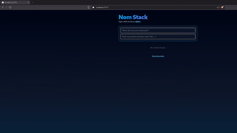

## 🍴 NomStack

A tiny, fast, privacy-friendly recipe search tool that helps you find dishes instantly — no accounts, no tracking, no fluff. Built because sometimes you just want to look up a meal without getting blasted by ads. 🦝

[](https://github.com/NickTheDevOpsGuy/NomStack/actions/workflows/NomStack.yml)


---

## 🖼 Preview

### Main App Demo

Here’s the NomStack experience in motion — real searches, real speed, real UI.
The GIF is recorded straight from the production build so devs can instantly see how the whole flow feels without firing up the project.



> **Taste-test NomStack:** https://nom-stack.vercel.app/  
> Search anything. Get instant results.

---

## 🚀 Features

- Super-fast recipe lookup powered by TheMealDB API
- Clean, minimal UI with TailwindCSS v4
- Local history tracking with useLocalStorage
- Recent searches + favorites saved privately in your browser
- Safe Mode filtering to block unwanted or NSFW results
- Loading, empty, and error states for a smooth UX
- Keyboard-friendly search (Enter to submit)
- TypeScript-first architecture for predictable data handling
- Component-based structure that’s easy to expand

---

## 🗓️ Roadmap

- [ ] Multi-variant dish view
- [ ] Better search suggestions
- [ ] Dark mode polish
- [ ] Export favorites list
- [ ] Recipe card sharing

---

## 🛠 Tech Stack

- React 18 — component-driven UI
- Vite — ultra-fast dev server and bundler
- TypeScript — strict typing for safer code
- TailwindCSS v4 — utility-first styling
- Husky + lint-staged — pre-commit quality checks
- ESLint + Prettier + Stylelint — consistent formatting and linting
- GitHub Actions — CI pipeline for linting, building, and type-checking
- LocalStorage hooks — persisted state for recents, favorites, and preferences
- TheMealDB API — dish lookup datasource

---

## 📦 Getting Started

1. **Clone the repository**

   ```bash
   git clone https://github.com/NickTheDevOpsGuy/Project Name.git
   cd Project Name
   ```

2. **Install dependencies**

   ```bash
   npm install
   ```

3. **Run the development server**

   ```bash
   npm run dev
   ```

---

## 📂 Project Structure

<details>
<summary>📁 Click to expand file structure</summary>

```plaintext
.
├── eslint.config.ts
├── .github
│   ├── ISSUE_TEMPLATE
│   │   ├── bug.yml
│   │   ├── config.yml
│   │   ├── documentation.yml
│   │   ├── enhancement_refactor.yml
│   │   ├── feature_request.yml
│   │   └── question_discussion.yml
│   ├── pull_request_template.md
│   └── workflows
│       └── NomStack.yml
├── .gitignore
├── .husky
│   ├── pre-commit
│   └── pre-push
├── index.html
├── LICENSE
├── package.json
├── package-lock.json
├── .prettierignore
├── .prettierrc
├── .prettierrc.json
├── .prettierrc.yml
├── public
│   ├── assets
│   │   ├── nomstack.svg
│   │   └── preview.mp4
├── README.md
├── scripts
│   └── precheck.sh
├── src
│   └── app
│       ├── App.tsx
│       ├── components
│       │   ├── DishResult
│       │   │   └── DishResult.tsx
│       │   ├── SearchBar
│       │   │   └── SearchBar.tsx
│       │   └── StateDisplay
│       │       ├── Empty.tsx
│       │       ├── ErrorMessage.tsx
│       │       ├── index.ts
│       │       └── Loading.tsx
│       ├── hooks
│       │   ├── useDebouncedValue.ts
│       │   ├── useDishLookup.ts
│       │   └── useLocalStorage.ts
│       ├── main.tsx
│       ├── styles
│       │   └── global.css
│       ├── types
│       │   └── dish.types.ts
│       └── utils
│           ├── constants.ts
│           ├── fetchDish.ts
│           └── normalizeDishData.ts
├── .stylelintrc.json
├── tsconfig.app.json
├── tsconfig.json
├── tsconfig.node.json
└── vite.config.ts
```

</details>

---

## 🤝 Contributing

- 🐛 Report bugs in [Issues](../../../../issues)
- 💡 Suggest features or improvements
- 🔧 Open a Pull Request

---

## 🦝 Built by NickDoesDevOps

Created with ☕, curiosity, and a touch of chaos by [Nicholas Clark](https://www.linkedin.com/in/nickdoesdevops).  
Follow the journey → [GitHub](https://github.com/NickTheDevOpsGuy) • [LinkedIn](https://www.linkedin.com/in/nickdoesdevops)

🏷 #NickDoesDevOps • #LearningInPublic • #BuiltInPublic
